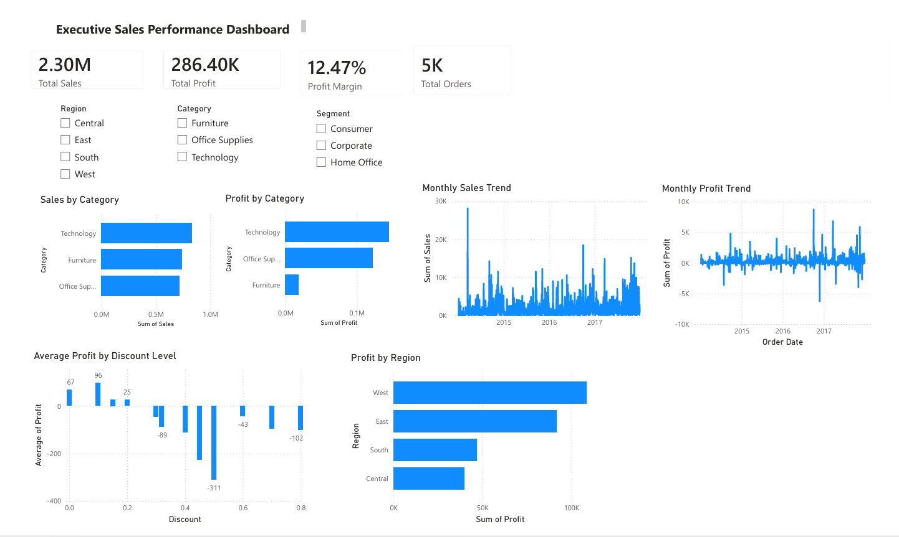
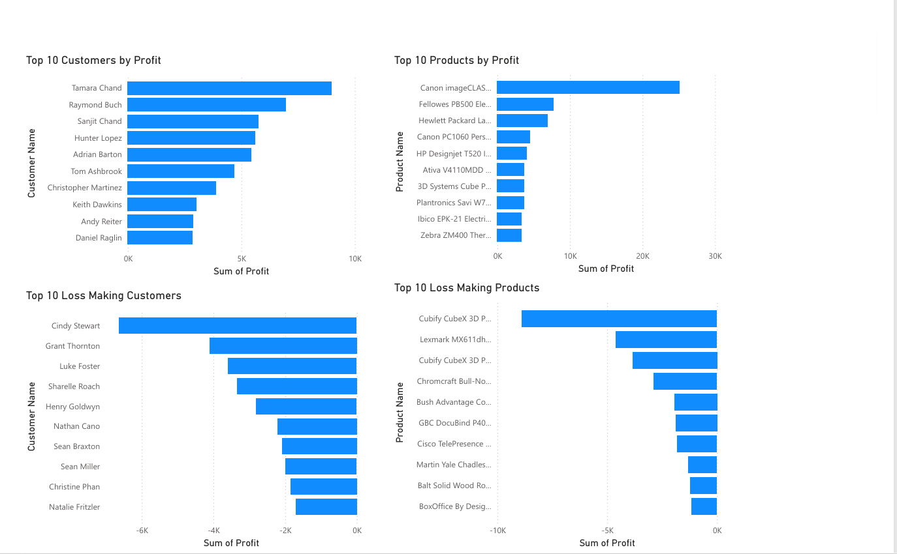

# E-Commerce Sales & Profitability Analysis



## Executive Summary

This project analyzes nearly 10,000 retail transactions from a U.S. Superstore to identify the key drivers of sales, profitability, customer performance, and regional growth opportunities.

Using Python for exploratory analysis and Power BI for dashboard development, the study uncovered significant profitability challenges linked to discounting practices, product mix, and regional performance disparities.

The analysis revealed that while Technology products generated the highest profits, excessive discounting remained a major contributor to profit erosion across multiple categories and markets.

---

## Business Problem

High sales do not necessarily translate into high profitability.

Management sought to understand:

- Which products and categories drive profit?
- Which customers contribute the most value?
- How do discounts impact profitability?
- Which regions and cities require intervention?
- What actions can improve overall business performance?

---

## Project Objectives

- Analyze sales and profitability trends
- Identify high-value customers and products
- Evaluate regional performance
- Assess the impact of discounting
- Develop actionable business recommendations
- Build an interactive executive dashboard

---

## Dataset Overview

**Dataset:** Sample Superstore Dataset

| Metric | Value |
|----------|----------|
| Orders | ~9,994 |
| Sales | $2.30M |
| Profit | $286K |
| Profit Margin | 12.47% |

Key variables analyzed:

- Sales
- Profit
- Discount
- Quantity
- Customer Segment
- Category & Sub-Category
- Region
- Shipping Mode
- Order Date

---

## Methodology

### Data Preparation

- Missing value assessment
- Data quality validation
- Date conversion and feature engineering

### Exploratory Data Analysis

- Monthly sales trends
- Monthly profit trends
- Regional performance analysis
- Customer profitability analysis
- Product profitability analysis
- Discount impact assessment
- Correlation analysis

### Dashboard Development

A two-page Power BI dashboard was developed to enable executive-level decision-making through interactive visualizations and KPI tracking.

---

## Key Findings

### 1. Technology Drives Profitability

Technology generated the highest profit and profit margin among all categories, making it the strongest contributor to business performance.

### 2. Furniture Underperforms

Despite strong sales volume, Furniture delivered significantly lower margins, highlighting pricing and cost structure concerns.

### 3. Discounting Erodes Profit

A strong negative relationship (-0.67 correlation) was observed between Discount and Profit, indicating that aggressive discounting frequently reduces profitability.

### 4. Regional Performance Varies Significantly

The West region emerged as the most profitable market, while several cities consistently generated losses and require corrective action.

### 5. Profitability Is Highly Concentrated

A relatively small group of customers and products contributed a disproportionate share of overall profit.

---

## Dashboard Preview

### Executive Dashboard


### Customer & Product Dashboard




---

## Business Recommendations

### Optimize Discount Strategy

Implement stricter discount governance and reduce excessive promotional activity on low-margin products.

### Expand High-Margin Product Focus

Increase investment in Technology products through targeted marketing and inventory optimization.

### Address Underperforming Markets

Investigate loss-making cities and replicate successful practices from high-performing regions.

### Strengthen Customer Portfolio Management

Retain high-profit customers while reviewing pricing and discount strategies for recurring loss-making accounts.

### Improve Product Mix

Reduce focus on persistently loss-making products and prioritize profitable product segments.

---

## Tools & Technologies

- Python
- Pandas
- NumPy
- Matplotlib
- Seaborn
- Jupyter Notebook
- Power BI

---

## Repository Structure

```text
superstore-sales-profitability-analysis/

├── Superstore_Analysis.ipynb
├── Superstore_Analysis.pdf
├── Superstore_Sales_Analytics.pbix
├── dashboard_executive.png
├── dashboard_customer_product.png
├── Sample_Superstore.csv
└── README.md
```

---

## Project Outcomes

This project demonstrates the ability to:

- Perform end-to-end business analytics
- Translate data into actionable recommendations
- Develop executive dashboards
- Communicate findings in a consulting-style format
- Support data-driven business decision-making
